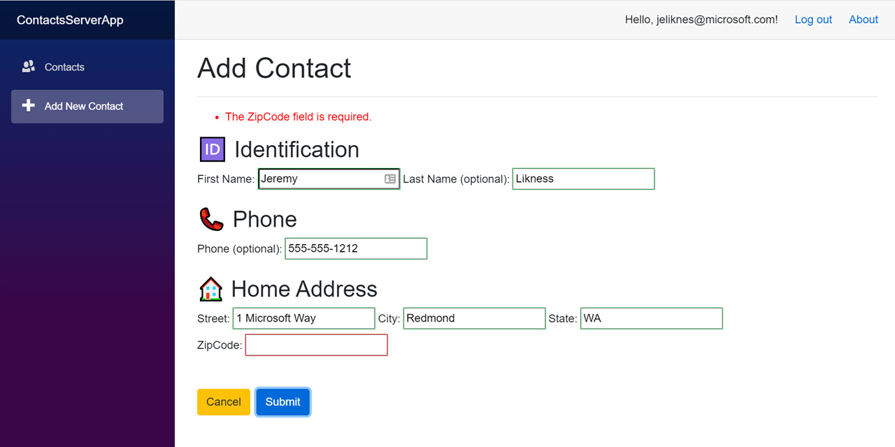

# BlazorServerEFCoreExample

Example of a Blazor Server project that uses Entity Framework Core for data access.

The project relies on a set of core, shared libraries that were created for a [Blazor WebAssembly](https://github.com/JeremyLikness/BlazorWasmEFCoreExample) project.
It is linked as a submodule to this project.
Read about how that was built here (note: series is valid up to commit 
[e6ac27b](https://github.com/JeremyLikness/BlazorWasmEFCoreExample/commit/e6ac27b5b2b2c1d40406aa34e8884ec8b0e5808a)):

- [Build a Blazor WebAssembly Line of Business App Part 1: Intro and Data Access](https://blog.jeremylikness.com/blog/build-a-blazor-webassembly-line-of-business-app/)
- [Build a Blazor WebAssembly Line of Business App Part 2: Client and Server](https://blog.jeremylikness.com/blog/build-a-blazor-webassembly-line-of-business-app-part-2/)
- [Build a Blazor WebAssembly Line of Business App Part 3: Query, Delete and Concurrency](https://blog.jeremylikness.com/blog/build-a-blazor-webassembly-line-of-business-app-part-3/)

For the latest version, read about the latest round of refactoring here:

- [Build a Blazor WebAssembly LOB App Part 4: Make it Blazor-Friendly](https://blog.jeremylikness.com/blog/build-a-blazor-webassembly-line-of-business-app-part-4/)

The server-focused blog post is available here:

- [Build an Azure AD Secured Blazor Server Line of Business App](https://blog.jeremylikness.com/blog/build-a-blazor-server-azure-ad-secured-lob-app/)

## Features

* Azure AD Authentication
* Extended identity features to audit user creation, modification, email confirmation, and deletion
* Entity Framework Core
* Entity Framework Core logging
* Shadow properties: the database tracks row version, the user who created the entity and timestamp, and the user who last modified the entity and timestamp, without having to define these properties on the C# domain class
* Automatic audit that tracks changes with a before/after snapshot and is generated at the data context level
* Optimistic concurrency with delta resolution (when the database changes, the UI shows the changes so the user can overwrite or abort)
* Entity validation on the client and server using data annotations
* A grid that features paging, sorting, and filtering with debounce (i.e. typing three characters will result in just one database round trip)
* Dynamic filtering and sorting with serverside evaluation
* 99% of the UI is contained in a Razor class library that is usable from both Blazor WebAssembly and Blazor Server applications
* Example of the repository pattern: the client and server use the same interface with a different implementation

## Quick start

### Prerequisites

- .NET Core SDK ([3.1.300](https://dotnet.microsoft.com/download/dotnet-core/3.1) or later)
- Visual Studio Code, **OR**
- Visual Studio 2019 16.6 or later

### Code and Connection Strings

1. Optionally fork the repository.
1. Clone the repository (or your fork): 

   `git clone https://github.com/jeremylikness/BlazorServerEFCoreExample.git`
1. Navigate to the newly created directory
1. Navigate to the empty `BlazorWasmEFCoreExample` sub-directory. This is where the original repo will be cloned. Assuming you cloned with the defaults, your path will be `./BlazorServerEFCoreExample/BlazorWasmEFCoreExample`.
1. Type `git submodule init` to initialize the dependency on the original repo.
1. Type `git submodule update` to clone the files.
1. If you don't have `localdb` installed, update `appsettings.json` and `appsettings.Development.json` in the `ContactsApp.Server` project to point to a valid database instance. 
1. The `blazorcontactsdb` is used for the application database and must match `ContactContext.BlazorContactsDb` in the `ContactsApp.DataAccess` project (the default value is `blazorcontactsdb`).
1. Update the `AzureAD` section to point to your Azure AD domain, instance, tenant, and client.
1. Ensure that **ContactsServerApp** is set as the startup project.

### Visual Studio

1. Open the solution file.
1. Ensure the `ContactsServerApp` project is set as the start up project.
1. You are ready to launch the application.

See note at the end of the next section.

### Visual Studio Code

1. Navigate to the `ContactsServerApp` folder.
1. Type 

   `dotnet run`
    
   to start the server. Navigate to the port specified.
  
> **Note**: the demo app is designed to create and populate the contacts database the first time you open the web page. This may result in a delay of up to several minutes on first load. This is normal and is just used to make setup easier. Subsequent runs should load faster.

## Migrations for Contacts Database

See the [original repo](https://github.com/JeremyLikness/BlazorWasmEFCoreExample) for information on setting up migrations.

---

Submit any feedback, questions, suggestions, or issues [here](https://github.com/JeremyLikness/BlazorServerEFCoreExample/issues/new).

Regards,

[@JeremyLikness](https://twitter.com/JeremyLikness)
